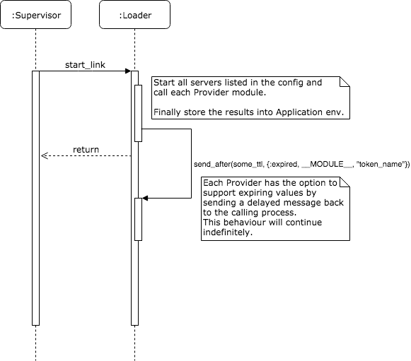

# Ptolemy v0.2 Design Doc
> ~~This document is designed to facilitate and grow with design discussions and is not yet complete.~~ This document has been finalized as the
> basis of Ptolemy v0.2. All content here may not be 100% accurate in the APIs due to possible implementation complications, but will be very
> close and give an idea as to what the goals and final state of the rewrite will look like.

## Intro

Ptolemy is now at a current stage where our thinking goes beyond the simple accessing and updating of secrets stored in a Vault server. For the idea of Application Managed secrets to fully be an accepted practice in the Elixir community, an effective and elegant solution will need to be built. We hope Ptolemy can fill this void. We envisioned Ptolemy to also provide capability of loading the secrets into your application environment and updating the secrets according to their ttl.

User has the choice of communicating directly with the CRUD interface of Ptolemy, which fetches secret from vault and allows manipulations on the secrets, these functions provide users with a great degree of flexibility. However, if you are looking for a convenient and performant way of accessing secrets, you are in luck. We offer a robust secret loading functionality. You can provide secrets that you would like to fetch from the Vault in config files, and Ptolemy would handle the task of loading secrets into your application environment like magic! It even takes care of refreshing the secret when they expire.

We are trying to restructure Ptolemy in order to make it generic enough to support various secret engines, thus the folder structure would need a overhaul. Here is a proposal on how the repository should look like.

## Application Environment Management

Independent of the Vault bindings (discussed in a later section), is the ability to inject and maintain secrets as they change on external providers. Starting with the vault bindings already existing in this library, the solution we propose will consist of an extendable collection of providers that all bring the ability to provide and maintain configurations.

The overall flow of the `Loader` module would be as follows as the application supervisor starts it up:


> [Edit link](https://www.draw.io/?lightbox=1&highlight=0000ff&edit=_blank&layers=1&nav=1&title=Untitled%20Diagram.xml#R7Vlbc%2BI2FP41zLQPyRgbg3kMAXZnmp2mTdpunxhhH7Aa2fLKMpf99T2SZeMbLGnIbGYbZhiko6OLj77z6ZPpObfR7oMgSfiJB8B6thXses60Z9t9ZzzCH2XZ5xbPMYa1oIFxOhge6FcwRstYMxpAWnOUnDNJk7rR53EMvqzZiBB8W3dbcVafNSFraBkefMLa1r9oIENj7VvWoeEj0HVopvZc07Ak%2FtNa8Cw28%2FVsZ6U%2FeXNEirGMfxqSgG8rJmfWc24F5zIvRbtbYCq2RdjyfvMjreW6BcTynA6jJVmSvj9Y%2BvZoNVhaV3Y%2BwoawzMSi59zccRKAMCuW%2ByJKuPhEFbOI3dEVMBpjbZKAoBFI9HemzJjvD7bJNqQSHhLiq65bxA%2FaQhkxrPWxiFsqCXYRZZ0xkqR0qWe10CLAz0RKN%2FA7pDlylJVnUs10WyJCu6qdgMAMVQbb0uNG1DdlRpbAJuXW3XLG1fQx1w%2BUSsGfoDDijlr6U7YUCFFTrChjFc%2B5%2Fig7PtWcRJSphPgTREBiYswG%2FX3b1LsmIoyuY7T5uK06iO19Nlu%2FASFhVzGZff8AHDdA7NHFtNoDg8EiR011WwF8gfewgnW3SFJikmxdDn0AGhYM1s7EXTFoFXhNvFVQknAaSz2%2FO%2Bm50wbsuJAhX%2FOYsCrwDmCwfnQwHE3rs9ExcGvgKJFQQ0cbHM7wAuD44vpPvz0Oon%2Bu%2BOwziz%2FOf3kIrsavjo8jITonskfD6NZzrDvJ2mG8RBRbK%2FW6qP0hw8BsaMrf6f1NZ%2FSz6b3M2DdB76%2Bfvf9ndveeC47vye7to7%2FfAkcqiZALTPinUzBRz0tRtN%2BYkC25lDzCBoiDG3ULUDbG%2FSdtwmV%2BNiDQlb%2FPQsSZuwkB3h%2FMIoEt%2BXZ2MEy0ARuK9Z5K8JRnwofTWYTBWcMxLBT7plZ0EgoCGJFIs7XpuzbWdL1XSVmRj3adX%2FrjBjbyJzG9GvAol%2FHf9YDTAs2DAo1agO6c4rEGIsUSo6lEYsDxYhW8EPKL44qulTPe1Owhw2hOlngEDteq5OdDAPFD%2FLkXfEP1%2FceKeJAxuG73aFvmFAmK7TV4uYByZgFpxmSqlyM5%2FtwkCUNUSMrV8iDedA5%2F5GyOuYRvH7rmHO0POpJG8qTCOgxWar4Uh6Lx%2BlG1Ta%2BGPxC9niXyTpOng3GsId%2FzWuxZHreXVnWduTBo5YIAmYn4peTJE8CmSUDSsFRZ2Gzi7H0v8oQdlSWVY1kz%2BbXjjU19uqs0TveVSkUwTA9oaFDlWVh4IXv23VENQ47VwEbO8S32xJ0h%2B4qbUUrHWbpxyS%2FmmR%2FxH3nP83dHJ%2F2xkK%2F4yOo8t9G7EchXPkOG76r0Zar0RTxqjxuX4zNVqPdaNNrxDipFuluQFT7zTynOspASR8HRrd5ogrdn2CVUKG2hTIvFp1%2Bnf9zNFgvjYg%2B%2FZOpF7kTiJsWLmERwsPVG059baKsy4QFQVTqs4LH7zL7TtandLYPreCxFcb8pikuKvR7XSHY0ci9FslUVe%2BqNzzdE8vHEvjhpD8YNuhq6Z9HVc0nbaZCqPbRPknDTv7imdZLwpbiz3xbgs5ZeDklaCl%2BeGImrVW%2BaJQnXcl3nEAK3GEv1WGrdjPjN7QS%2FAe7dXsv4CNJU%2FX%2BT%2F9tSDGh0PWruvE8iuI%2BOHWL6MaR6DgjJhuKOacbRD6xeTtE4Ay3OA1jRGGU1278L8jcuyL26IHec9kHSeZI0r6xnnCRYPfw7l%2BfS4S9QZ%2FYv)


The config of Ptolemy to support this functionality (along with already existing configs) would look something like:
```elixir
# define how to auth with :server1
config :ptolemy, Ptolemy,
  server1: %{
    vault_url: "http://localhost:8200",
    auth_mode: "approle",
    kv_engine: %{
      kv_engine1: %{
        engine_path: "secret/",
        secrets: %{
          ptolemy: "/ptolemy"
        }
      }
    },
    credentials: %{
      role_id: System.get_env("ROLE_ID"),
      secret_id: System.get_env("SECRET_ID")
    },
    opts: [
      iap_on: false,
      exp: 6000
    ]
  }.
  server2: %{...}

# define :secret_1 to be provided by :server1 from the secret found on "SECRET_PATH"
condif :ptolemy, env: [
  {{:app_name, :secret_1}, {:server1, "SECRET_PATH"}},

  # Future extensions to third-party providers can also be supported:
  {{:app_name, :another_secret}, {ThirdParty.Provider, "any_kind_of_args"}}

  # Note that the args passed to servers or providers can be of any type
]
```

> *Caveat:* The proposed configuration only supports top-level configuration values. The intention is to support complex configuration structures with a reference mechanism. As the project evolves we hope to discover a better format.

The providers would implement the `Ptolemy.Provider` behavior. For example:
```elixir
defmodule MyApp.Provider do
  use Ptolemy.Provider

  @impl
  def provide(loader_pid, args) do
    {value, ttl_ms} = MyApp.SomeApi.get_value(args)
    send(loader_pid, {:expired, __MODULE__, args})
    value
  end
end
```

When the provider sends the `:expired` message back to the loader, it identifies what values should be updated in the application's environment. This will trigger the Loader to call the `provider/1` function of the module again, retrieving the new value and sending the delayed expiry message again.


## Forcing Process Restarts
We were considering developing a Ptolemy.Supervisor that restarts process in order to reload the application environment

But, we've reached the consensus that it's unnecessary to implement the Ptolemy supervisor which crashes the process in order to update the application's environment variables.

Reasons are as follow:

1. Forcing our users to use Ptolemy.Supervisor is an over opinionated way of managing application variables. It would require users to give up control to the restart process.
2. If the user follow the OTP restart practices, they would save the states, including the environment variables, when the process gets terminated. Thus, even letting it crash and reloading the application would not be able refresh their tokens. The application would just keep using the old secrets and keep crashing.

Considering factors above, we will be scrapping the Ptolemy.Supervisor module and Ptolemy will not be responsible for managing lifecycle of applications that stores secrets in their states. Ptolemy will only update secrets in the Applications environment variables as they expire. In order to utilize full capability of Ptolemy, we strongly recommend users to use Application.get_env() and NOT store secrets in states.


## Current Vault Integration Rework

#### Current
```
Ptolemy/
├── config
│   └── config.exs
├── lib
│   ├── engines
│   │   └── kv.ex
│   ├── ptolemy.ex
│   ├── ptolemy_server.ex
│   └── ...
└── ...
```
Currently, `ptolemy_server.ex` contains CRUD operations for kv engine specifically, and `lib/engine/kv.ex` contains the communication interface for kv engine. The structure is not flexible enough to add additional engine support. With modularized design in mind, we propose the following the structure.


#### Proposal
```
Ptolemy/
├── lib
│   ├── engines
│   │   ├── kv
│   │   |   ├── kv_server.ex
│   │   |   └── kv.ex
│   │   ├── gcp
│   │   |   ├── gcp_server.ex
│   │   |   └── gcp.ex
│   │   └── ...
│   ├── providers
│   │   ├── vault_provider.ex
│   │   └── ...
│   ├── provider.ex
│   ├── loader.ex
│   ├── ptolemy.ex
│   ├── ptolemy_server.ex
│   └── ...
└── ...
```

#### providers
`providers/provider.ex` specifies behaviours that a provider should implement

`providers/vault_provider.ex` by default load secrets from vault


#### loaders
`loader/loader.ex` will provide functions beahviours that loads secrets from provider to the application environment variables

`loader/vault_loader.ex` will be implementation of the loader specific to vault


##### ptolemy.ex
`ptolemy.ex` will only contain a generic CRUD functions for users to interact, each function should take in the engine name as a parameter in order to pattern match with the correct support engine to call.  The underneath implementation of CRUD operations should lie within `lib/engines` folder. For example, `kv.ex` would still contain the communication functions, and `kv_server.ex` would be responsible for making the `ptolemy.ex` functions happen.

```elixir
defmodule Ptolemy do
  @doc start Ptolemy process
  def start(name, config) do
    Server.start_link(name, config)
  end

  @doc create secrets
  def create(pid, engine_name, secret, payload, opts // []) do
    # ...
  end

  @doc fetches all secrets from a specified path
  def fetch(pid, engine_name,  secret, opts // []) do
    # ...
  end

  @doc read one specific secret from the path
  def read(pid, engine_name, secret, secret_name, opts // []) do
    # ...
  end

  @doc update a secret
  def update(pid, engine_name, secret, payload, opts // []) do
    # ...
  end

  @doc move a secret into recycle bin
  def delete(pid, engine_name, secret, opts // []) do
    # ...
  end

  @doc destroy a secret completely
  def destroy(pid, engine_name, secret, opts // []) do
    # ...
  end
end
```

